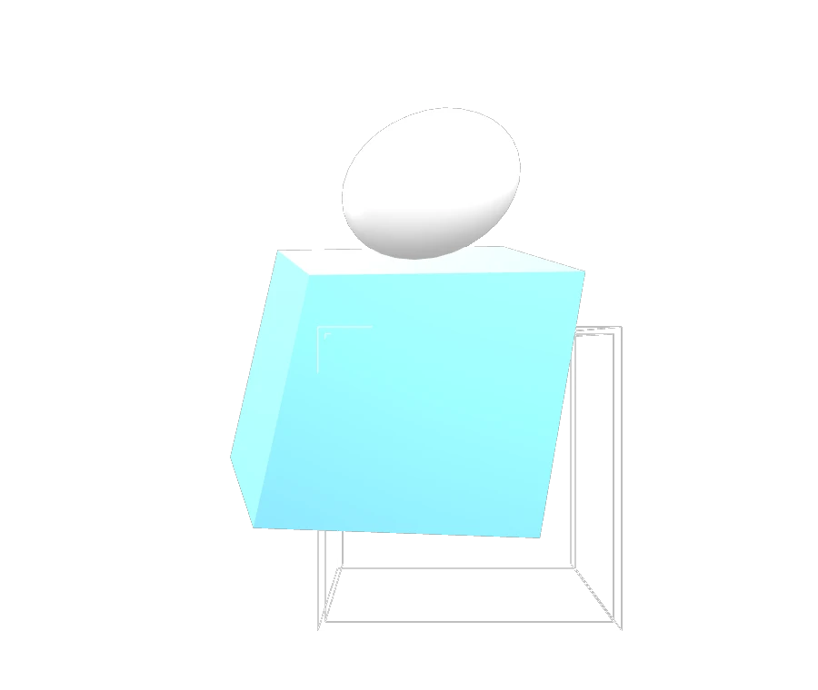

# Affine Transformation Animation

<!-- This file is auto-generated by modelmetadata. Do not edit by hand. -->

## Tags

[extension](../Models-extension.md), [testing](../Models-testing.md)

## Summary

Tests animated affine transformations and transform decomposition.

## Operations

* [Display](https://github.khronos.org/glTF-Sample-Viewer-Release/?model=https://raw.GithubUserContent.com/KhronosGroup/glTF-Sample-Assets/main/./Models/AffineTransformationAnim/glTF-Binary/AffineTransformationAnim.glb) in SampleViewer
* [Download GLB](https://raw.GithubUserContent.com/KhronosGroup/glTF-Sample-Assets/main/./Models/AffineTransformationAnim/glTF-Binary/AffineTransformationAnim.glb)
* [Model Directory](./)

## Screenshot

## Description

This asset tests animated affine transformations. It is intended to reveal issues with transform decomposition, animation import, and conversion pipelines that cannot preserve affine matrix behavior.

## Legal

&copy; 2026, Needle. [Creative Commons Attribution 4.0 International](https://creativecommons.org/licenses/by/4.0/legalcode)

 - Needle for Everything

<!-- This file is auto-generated by modelmetadata. Do not edit by hand. -->
