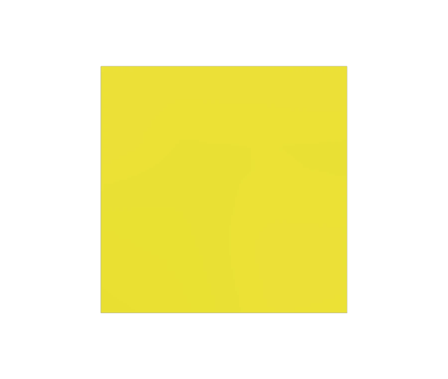

# Cube To Sphere

<!-- This file is auto-generated by modelmetadata. Do not edit by hand. -->

## Tags

[extension](../Models-extension.md), [testing](../Models-testing.md)

## Summary

Tests morphing or topology-changing geometry with Draco and Meshopt compressed variants.

## Operations

* [Display](https://github.khronos.org/glTF-Sample-Viewer-Release/?model=https://raw.GithubUserContent.com/KhronosGroup/glTF-Sample-Assets/main/./Models/CubeToSphere/glTF-Binary/CubeToSphere.glb) in SampleViewer
* [Download GLB](https://raw.GithubUserContent.com/KhronosGroup/glTF-Sample-Assets/main/./Models/CubeToSphere/glTF-Binary/CubeToSphere.glb)
* [Model Directory](./)

## Screenshot

## Description

This asset tests geometry that transitions from a cube-like shape to a sphere-like shape. It includes source, Draco, and Meshopt variants to compare geometry compression behavior with the same authored content.

## Legal

&copy; 2026, Needle. [Creative Commons Attribution 4.0 International](https://creativecommons.org/licenses/by/4.0/legalcode)

 - Needle for Everything

<!-- This file is auto-generated by modelmetadata. Do not edit by hand. -->
