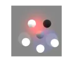

# Lights Roundtrip

<!-- This file is auto-generated by modelmetadata. Do not edit by hand. -->

## Tags

[extension](../Models-extension.md), [testing](../Models-testing.md)

## Summary

Tests round-tripping punctual light types and parameters.

## Operations

* [Display](https://github.khronos.org/glTF-Sample-Viewer-Release/?model=https://raw.GithubUserContent.com/KhronosGroup/glTF-Sample-Assets/main/./Models/LightsRoundtrip/glTF-Binary/LightsRoundtrip.glb) in SampleViewer
* [Download GLB](https://raw.GithubUserContent.com/KhronosGroup/glTF-Sample-Assets/main/./Models/LightsRoundtrip/glTF-Binary/LightsRoundtrip.glb)
* [Model Directory](./)

## Screenshot

## Description

This asset tests `KHR_lights_punctual` round-tripping for multiple punctual light types and parameters. It is intended to reveal lost light definitions, changed intensity or color, and transform mistakes in importers, exporters, and conversion pipelines.

## Legal

&copy; 2026, Needle. [Creative Commons Attribution 4.0 International](https://creativecommons.org/licenses/by/4.0/legalcode)

 - Needle for Everything

<!-- This file is auto-generated by modelmetadata. Do not edit by hand. -->
