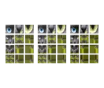

# Texture Wrap Modes

<!-- This file is auto-generated by modelmetadata. Do not edit by hand. -->

## Tags

[extension](../Models-extension.md), [testing](../Models-testing.md)

## Summary

Tests texture sampler wrap modes and texture transform handling.

## Operations

* [Display](https://github.khronos.org/glTF-Sample-Viewer-Release/?model=https://raw.GithubUserContent.com/KhronosGroup/glTF-Sample-Assets/main/./Models/TextureWrapModes/glTF-Binary/TextureWrapModes.glb) in SampleViewer
* [Download GLB](https://raw.GithubUserContent.com/KhronosGroup/glTF-Sample-Assets/main/./Models/TextureWrapModes/glTF-Binary/TextureWrapModes.glb)
* [Model Directory](./)

## Screenshot

## Description

This asset tests texture sampler wrap modes, including repeat, clamp, and mirrored repeat behavior, with texture transform usage. It is intended to make incorrect sampler state or transform handling visible in viewers and conversion pipelines.

## Legal

&copy; 2026, Needle. [Creative Commons Attribution 4.0 International](https://creativecommons.org/licenses/by/4.0/legalcode)

 - Needle for Everything

<!-- This file is auto-generated by modelmetadata. Do not edit by hand. -->
