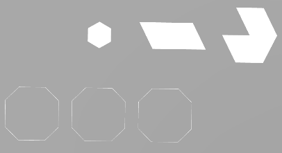

# Triangle Without Indices

## Tags

[core](../../Models-core.md), [testing](../../Models-testing.md)

## Summary

Collection of simple Lines, LineStrips, LineLoops, Triangles, TriangleStrips and TriangleFans primitives without indices.

## Operations

* [Display](https://github.khronos.org/glTF-Sample-Viewer-Release/?model=https://raw.GithubUserContent.com/KhronosGroup/glTF-Sample-Assets/main/./Models/TopologiesWithoutIndices/glTF/TopoNoIndices.gltf) in SampleViewer
* [Model Directory](./)

## Screenshot

## Description

Collection of simple Lines, LineStrips, LineLoops, Triangles, TriangleStrips and TriangleFans primitives without indices.

## Data layout

## Legal

&copy; 2026, Needle. [Creative Commons Attribution 4.0 International](https://creativecommons.org/licenses/by/4.0/legalcode)

 - Needle for Everything

#### Assembled by modelmetadata